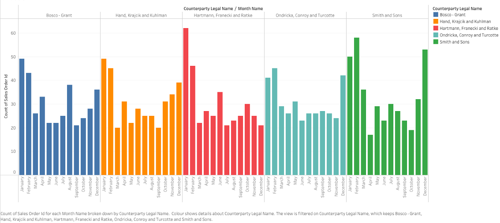
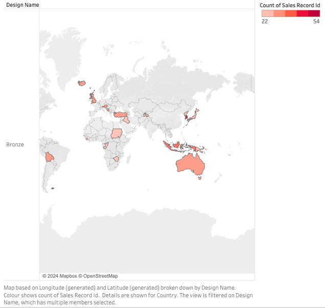

## Data Visualization

As an example, the folowing graphics were generated through 'Tableau' using data from the warehouse:

Count of sales by month for the top 5 clients:

Sales records for the top seller design, displayed by purchase location:

