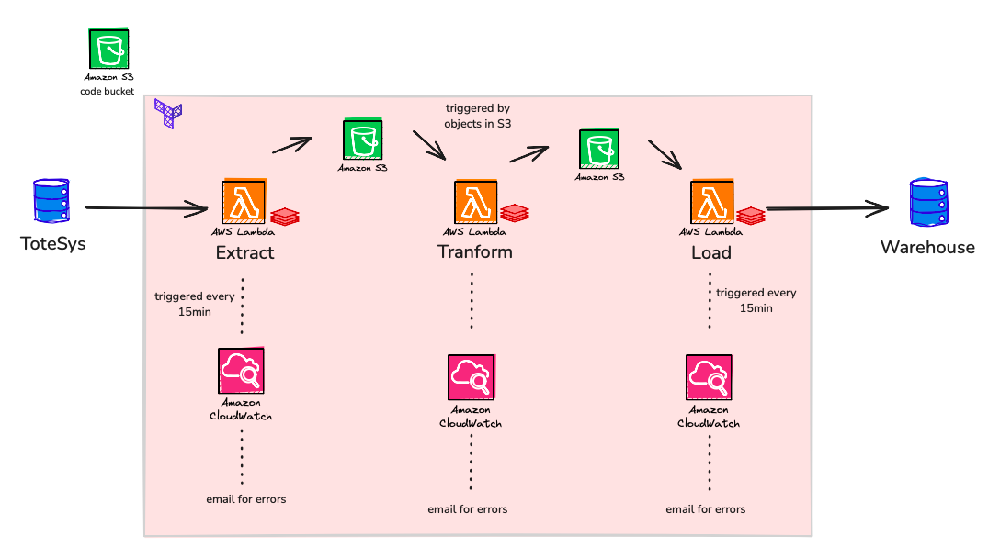
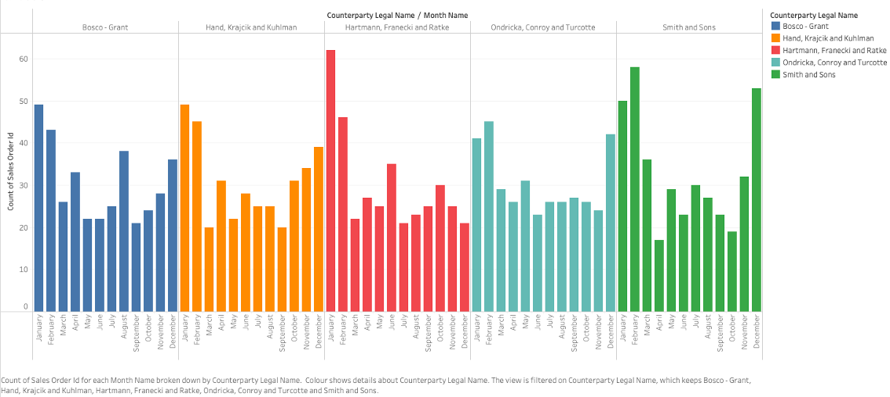
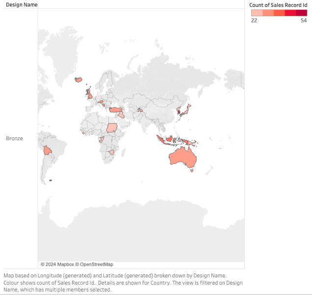

# Totesys Pipeline


This project will create and deploy an AWS pipeline for transferring data from a database into a data warehouse. 
The system takes data from an initial database, converts to json in a lambda function, and stores in a s3 bucket. It then uses another lambda function to reformat into a schema matching that of our target data warehouse and store in a second s3. Finally, the data is uploaded from the bucket to a data warehouse with a lambda function.

## Authors

- [@Laura0730](https://github.com/Laura0730)
- [@oggzy](https://github.com/oggzy)
- [@Terra-CS](https://github.com/Terra-CS)
- [@Wesshaw1](https://github.com/Wesshaw1)
- [@ZShaan0](https://github.com/ZShaan0)

## Deployment

This project can either be deployed through github actions

if you want to deploy to aws without github, run the following commands inside the terraform directory:

```bash
  terraform init
  terraform plan
  terraform apply
```

to set up the development environment :

```bash
  make requirements
  make dev-setup
```

On deployment, the following structure (inside the terraform red rectangle) will be created on aws:




## Infrastructure

Requires a pre-made s3 backend bucket to store the terraform state.


## Secrets

To run this project via github actions pipeline. you will need to add the following to your Github secrets

AWS_ACCESS_KEY_ID

AWS_SECRET_ACCESS_KEY

AWS_DEFAULT_REGION

you will also need a github variable

EMAIL_ENDPOINT

you will also need to add the following to your AWS secretsmanager

```bash
{'totesys_db_credentials' : 
{"username" : DATABASE_USERNAME
 "dbname" : DATABASE_NAME
 "password" : DATABASE_PASSWORD
 "host" : DATABASE_HOST
 "port" : DATABASE_PORT_NO }
}
```
```bash
{'project_dw_credentials' : 
{"username" : DATABASE_USERNAME
 "dbname" : DATABASE_NAME
 "password" : DATABASE_PASSWORD
 "host" : DATABASE_HOST
 "port" : DATABASE_PORT_NO }
}
```
    
## Tech Stack 

**Client:** Python and Terraform

**Database** postgres

**Server:** AWS


## Running Tests

To run tests, you must have setup the development environment, then you can run the following 
command:
```bash
  make run-checks
```
This will run Pytest, Safety, Bandit and Flake8.

## Data Visualization

As an example, the folowing graphics were generated through 'Tableau' using data from the warehouse:

Count of sales by month for the top 5 clients:



Sales records for the top seller design, displayed by purchase location:
